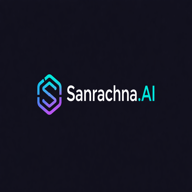

# 🚀 Sanrachna.AI

<p align="center">
  
</p>

<p align="center">
  <strong>A modern full-stack application platform with SSO authentication</strong>
</p>

<p align="center">
  <a href="#features">Features</a> •
  <a href="#tech-stack">Tech Stack</a> •
  <a href="#getting-started">Getting Started</a> •
  <a href="#contributing">Contributing</a>
</p>

---

## ✨ Features

- 🔐 **Centralized SSO Authentication** - Single sign-on with Google OAuth
- 📱 **Progressive Web App (PWA)** - Install on mobile devices
- 🎨 **Modern UI** - Built with Angular 19 and Tailwind CSS
- 🌐 **RESTful API** - .NET 8 backend with Azure Cosmos DB
- 🔒 **Secure** - JWT-based authentication with refresh tokens

---

## 🛠 Tech Stack

| Layer | Technology |
|-------|------------|
| **Frontend** | Angular 19, Tailwind CSS, TypeScript |
| **Backend** | .NET 8, ASP.NET Core Web API |
| **Database** | Azure Cosmos DB |
| **Auth** | JWT, Google OAuth 2.0 |
| **Hosting** | Azure App Service, Netlify |

---

## 📁 Project Structure

```
Sanrachna.Ai/
├── Sanrachna.ai-BE/          # Backend (.NET 8 API)
│   └── Sanrachna.Ai/         # Main API project
│       ├── Controllers/      # API endpoints
│       ├── Services/         # Business logic
│       ├── Models/           # Data models
│       └── appsettings.json  # Configuration
│
├── Sanrachna.ai-FE/          # Frontend Applications
│   ├── LoginTerminal/        # Main SSO Login Portal (PWA)
│   ├── Viraasat360/          # Heritage Management App
│   ├── StandBy-Habits/       # Habit Tracking App
│   └── YourFinance360/       # Finance Management App
│
└── README.md
```

---

## 🚀 Getting Started

### Prerequisites

- **Node.js** v18+ ([Download](https://nodejs.org/))
- **.NET 8 SDK** ([Download](https://dotnet.microsoft.com/download))
- **Angular CLI** (`npm install -g @angular/cli`)
- **Git** ([Download](https://git-scm.com/))

### 1️⃣ Clone the Repository

```bash
# Fork the repo first on GitHub, then clone your fork
git clone https://github.com/<your-username>/Sanrachna.Ai.git
cd Sanrachna.Ai
```

### 2️⃣ Backend Setup

```bash
# Navigate to backend
cd Sanrachna.ai-BE/Sanrachna.Ai

# Restore dependencies
dotnet restore

# Update appsettings.Development.json with your configuration
# - Database connection string
# - Google OAuth credentials
# - JWT secret key

# Run the backend
dotnet run
```

The API will be available at `http://localhost:5000`

### 3️⃣ Frontend Setup

```bash
# Navigate to frontend (LoginTerminal)
cd Sanrachna.ai-FE/LoginTerminal

# Install dependencies
npm install

# Run the development server
ng serve
```

The app will be available at `http://localhost:4200`

### 4️⃣ Run All Frontend Apps (Optional)

```bash
cd Sanrachna.ai-FE

# Start all apps
./start-all.sh

# Stop all apps
./stop-all.sh
```

| App | Port |
|-----|------|
| LoginTerminal | 4200 |
| StandBy-Habits | 4202 |
| Anti-Goal | 4203 |
| LoginHeaderTemplate | 4204 |
| Viraasat360 | 4205 |

---

## ⚙️ Environment Configuration

### Backend (`appsettings.Development.json`)

```json
{
  "ConnectionStrings": {
    "DefaultConnection": "your-cosmos-db-connection-string"
  },
  "JwtSettings": {
    "SecretKey": "your-secret-key",
    "Issuer": "Sanrachna.AI",
    "Audience": "Sanrachna.AI"
  },
  "GoogleSettings": {
    "ClientId": "your-google-client-id",
    "ClientSecret": "your-google-client-secret"
  }
}
```

### Frontend (`environment.ts`)

```typescript
export const environment = {
  production: false,
  apiUrl: 'http://localhost:5000/api',
  oauth: {
    google: {
      clientId: 'your-google-client-id',
      redirectUri: 'http://localhost:4200/auth/google/callback'
    }
  }
};
```

---

## 🤝 Contributing

We welcome contributions! Please follow these steps:

### 1. Fork & Clone

```bash
# Fork on GitHub, then:
git clone https://github.com/<your-username>/Sanrachna.Ai.git
cd Sanrachna.Ai
```

### 2. Create a Branch

```bash
git checkout -b feature/your-feature-name
# or
git checkout -b fix/your-bug-fix
```

### 3. Make Changes

- Write clean, readable code
- Follow existing code style
- Add comments where necessary
- Test your changes locally

### 4. Commit

```bash
git add .
git commit -m "feat: add your feature description"
# or
git commit -m "fix: fix your bug description"
```

**Commit Message Format:**
- `feat:` - New feature
- `fix:` - Bug fix
- `docs:` - Documentation changes
- `style:` - Code style changes (formatting)
- `refactor:` - Code refactoring
- `test:` - Adding tests
- `chore:` - Maintenance tasks

### 5. Push & Create PR

```bash
git push origin feature/your-feature-name
```

Then create a Pull Request on GitHub.

---

## 📝 Code Style Guidelines

### Frontend (Angular/TypeScript)
- Use standalone components
- Follow Angular style guide
- Use TypeScript strict mode
- Format with Prettier

### Backend (.NET)
- Follow C# naming conventions
- Use async/await patterns
- Implement proper error handling
- Use dependency injection

---

## 🧪 Running Tests

### Frontend
```bash
cd Sanrachna.ai-FE/LoginTerminal
ng test
```

### Backend
```bash
cd Sanrachna.ai-BE/Sanrachna.Ai
dotnet test
```

---

## 📄 License

This project is proprietary software. All rights reserved.

---

## 📞 Contact

- **Project Lead**: Santan
- **Email**: ltsantan47@gmail.com

---

<p align="center">
  Made with ❤️ by the Sanrachna.AI Team
</p>
